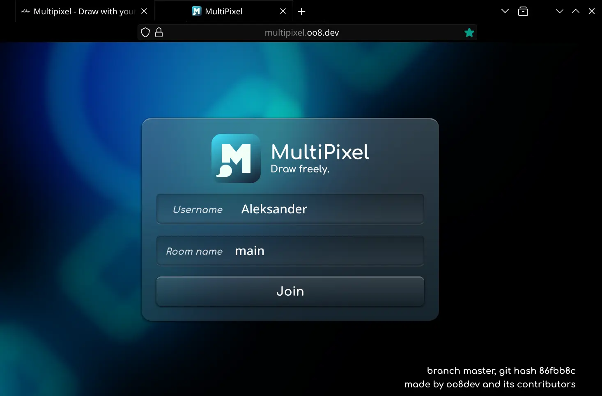

## **Main repository located at** [GitLab website](https://gitlab.com/oo8dev/multipixel)

# MultiPixel

## **An app for multiplayer drawing on an infinite canvas.**

Server written in Rust (formerly in C++, see "cpp" tag), client written in Typescript.

# **[Try it out! (Public server)](https://multipixel.oo8.dev)**

<center>




</center>

#

## Features

- Infinite canvas
- Multiple rooms support
- Chat
- Undo support
- Brush smoothing
- ~~Lua Plugin support~~ (cpp branch only)

Tools:

- Brush
- Bucket fill
- Gradient editor

#

## Technical features (Server)

- Fully asynchronous multithreading
- Up to 65535 clients supported
- Up to 18446744073709551616 pixels ((2^32)\*(2^32)) in one room. Good luck finding real boundary limits.
- LZ4 chunk compression
- WebSockets
- SQLite3 room storage
- Written in Rust 🦀

#

## Technical features (Client)

- Written in Typescript
- Powered by WebGL 2
- LZ4 chunk decompression
- WebSockets

# Installation

## Launching server

### Requirements:

- Rust compiler + functional cargo env

Build commands:

```bash
cargo run
```

## Preparing client

### Requirements:

- npm with required packages

Build commands:

```bash
# Change directory
cd web

# Install dependencies
npm install

# Build web application
npm run build:prod
# or:
npx webpack serve
```

Built web app is located in `./web/dist` directory.

### Changing server address

1. `export CONNECT_URL="ws://1.2.3.4:59900"`
2. Build web app again (commands above)

#

### Pull requests are welcome.
